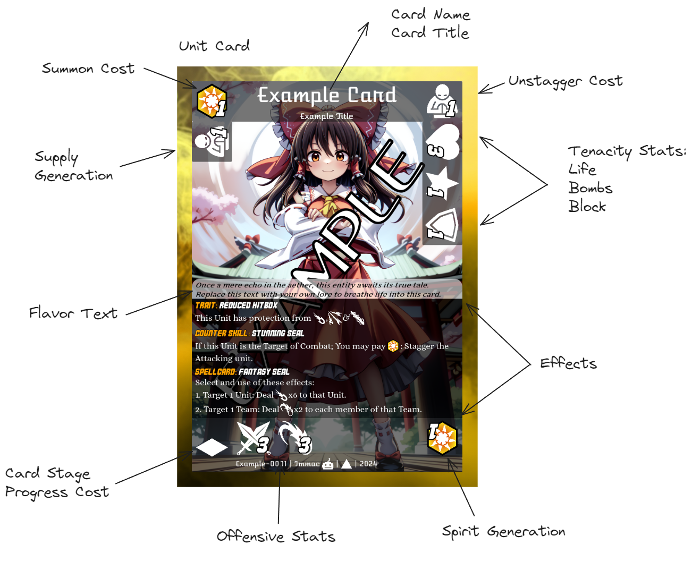
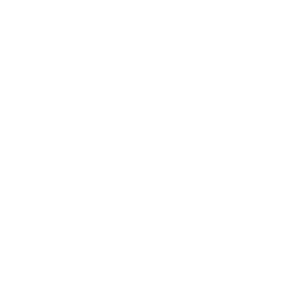
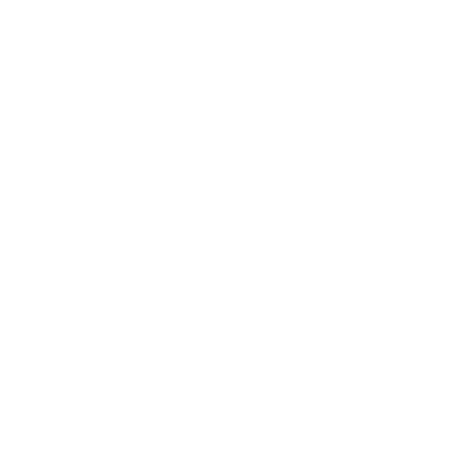
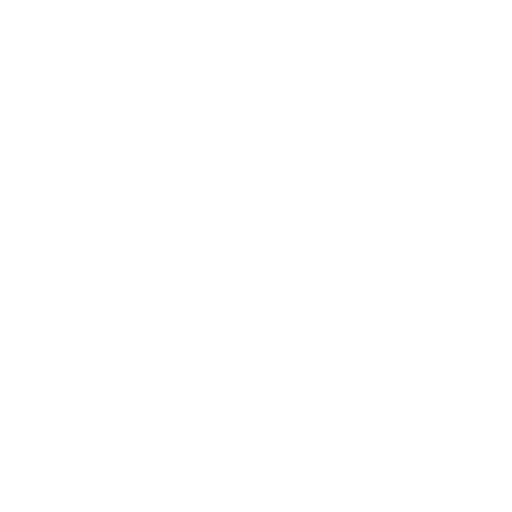
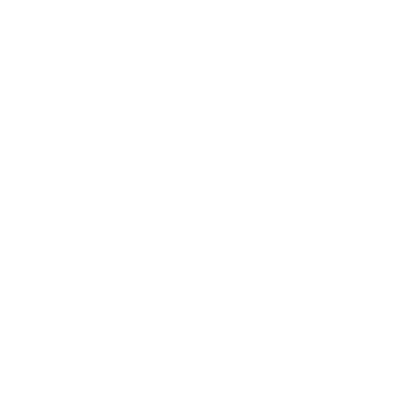
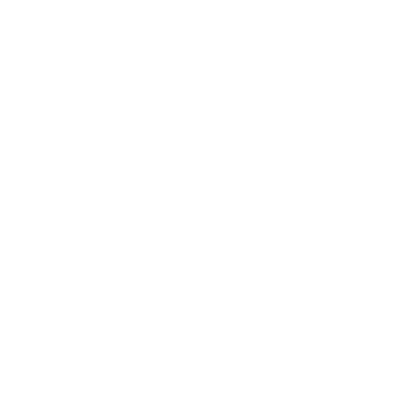

<script src="https://kit.fontawesome.com/a1fb323f80.js" crossorigin="anonymous"></script>
<style> td img { background-color: #252525; height:32px; border-radius: 5px; } .small-svg { background-color: #252525; height:32px; border-radius: 5px; }
.tiny-svg { background-color: #252525; height:24px; border-radius: 5px; }
th img { background-color: #252525; height:32px; border-radius: 5px; } 
i.fa-circle-check { color: green; } i.fa-circle-xmark { color: red; } </style>

```
This Documentation is a work in progress, 
thank you for your consideration.
```

## Rules and Game Mechanics

### Objective: _All Stage Clear_

The objective of the game is to Clear 7 of your Opponent's Stages, 6 Main Stages and 1 Extra Stage. Each Player takes turns, developing their board and Knocking Out opposing Units, as well as completing Objectives in order to Clear Stages. Be careful though, each Stage that is Cleared grants the Player with access to more resources and options. 

### Setup

To play the game you will need a deck composed of at least 50 Cards and a most 60 Non-Location Cards, this is your _Main Deck_. You will need a second deck of 12 Location Cards, this is your _Locations Deck_. You may have up to 4 copies of cards with the same Name on each deck. 

To start, set the Main Deck and the Locations Deck on the designated _Zone_ in the [Play Area]. Use a fair random method to choose which player will play first. Each player draws 5 Cards, then the Game Starts following the [Game Flow Chart] for each player.

### What is in a card?


### Playing a Card
Cards come in the following Card Types:
1. **Unit** Cards: Characters and creatures that players can deploy onto the **Battlefield**, they usually interact with each other via **Combat** or with the game state via **Effects**. Ally Units may **Team Up** to form a **Team**, more on this later.
2. **Item** Cards: Items and inanimate objects, they can be placed on the field and used by **Units** by attaching them to the **Unit** or **Team**. They perfom on, or add **Effects** to the **Unit** or **Team**.
3. **Spellcard** Cards: **Spellcard**s perform effects listed on them.
4. **Stage** Cards: **Stage** Cards denote what **Stage** your opponent is currently trying to Clear. **Stage** cards may have **Effects** that impact the whole board, and grow more powerful in the later **Stage**s. **Stage** cards have their own separate *Deck*.

```
Note: At the moment of writting there is plans for 
Unit, Item, Spellcard and Location cards.
```


Each player has a battle field, refer to the following picture for explanations.


 
In order to play a card, the card''s cost must be payed from yout **Spirit Power**, at least one of the **Spirit Power** used to pay must be of the same Element. More on **Spirit Charging** in the turn order section. Once the *Cost* is paid, you may play the card.

The following chart describes how the turns are played.


### Combat

### Combat Types

During the Battle Phase, the Active Player targets one of their Teams and an opposing Player’s Team to start a battle. _Enter Battle_ can be activated at this moment. Combat is divided into [Ranged Combat](#ranged-combat) (, , , )  and [Melee Combat](#melee-combat) (,,), each starting with a priority of 0. Card Effects can alter this priority. The Combat type with the highest priority is performed first. If priorities are tied at the start of the Duel Step, the current Player decides which Combat type occurs first. If both Units lack the Stats to perform a Combat Phase, that Phase is skipped.

#### Melee Combat

When melee combat is initiated, you first calculate advantage, then any Card Effects that can be activated during the Duel Step are activated, priority of activation starts with the current Player.

The table below explains the effectiveness of different Melee combat types against each other. Essentially, a unit’s Melee stat will double when fighting an opponent with a combat style it is strong against.

| Name | Icon | Target | (2x) VS |
| ---- | :----: | ------ | :----------: |
| Fighter |  | Single, Leader | 
| Wielder |  | Single, Leader | 
| Grappler |  | Single, Leader | 

> Example: 
>
> Grappler vs. Wielder: 
> - When a Grappler battles an Wielder, the Grappler’s Melee Stat will double. 

#### Ranged Combat
Cards can deal the following Types of damage. Damage can be avoided with  _Block_ or  _Graze_ in accordance to the chart below.

| Name | Icon | Target | Block? | Graze? |
| ---- | :----: | ------ | :----------: | :----------: |
| Direct |  | Single, Leader | <i class="fa-solid fa-circle-check"/>| <i class="fa-solid fa-circle-check"/>
| Spread |  | Team | <i class="fa-solid fa-circle-check"/>| <i class="fa-solid fa-circle-check"/>
| Homing |  | Single, Any | <i class="fa-solid fa-circle-check"/>| <i class="fa-solid fa-circle-xmark"/>
| Piercing |  | Team | <i class="fa-solid fa-circle-xmark"/>| <i class="fa-solid fa-circle-check"/>

- Describe the core gameplay mechanics:
    - How are cards played?
    - What are the win conditions?
    - Any special rules or interactions?
    - Explain turn structure, phases, and actions.

## Deck Building
- Guide players on constructing their decks:
    - Deck size
    - Card limits
    - Card ratios (characters, spells, etc.)
    - Sideboards (if applicable)

## Gameplay Examples
- Walk through sample turns or scenarios.
- Illustrate how cards interact with each other.

## Card Abilities and Keywords

(Spirit Trait: A Trait that is active when this Card exists in your Spirit Zone) (Trait: A Skill whose activation and effect cannot be negated)
- List common abilities (e.g., “Flying,” “Counter,” “Charge,” etc.).
- Explain their effects and how they impact gameplay.

## Artwork and Flavor
- Showcase card art and flavor text.
- Discuss the thematic elements inspired by the Touhou universe.

## Tournaments and Events
- If applicable, provide information on organized play:
    - Tournaments
    - Prizes
    - Community events

## FAQ and Troubleshooting
- Address common player questions.
- Troubleshoot issues related to rules or gameplay.

## Conclusion
- Summarize the key points.
- Encourage players to explore the game further.
